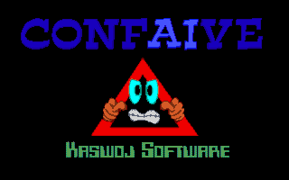
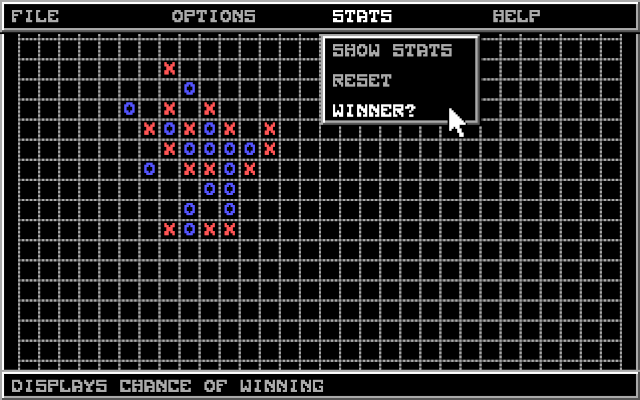

# Confaive

Connect Five with AI (Conf**ai**ve) was written by my younger self in 1999 using QBasic.

Conf**ai**ve was probably my last and most challenging QBasic project as it uses both the mouse and includes background
music (which in retrospect sounds rather irritating). Both these advanced features are not natively coded in QBasic but
rely on third-party executables, which makes it also more difficult to run the program.

## How to run the game

Go to one of the historic websites where the game still exists in a playable form:
- [Internet Archive](https://archive.org/details/Confaive)
- [DOS Game Zone](https://dosgamezone.com/game/confaive-7682.html)

Alternatively, you can try running it in a DOS emulator:
- https://www.dosbox.com
